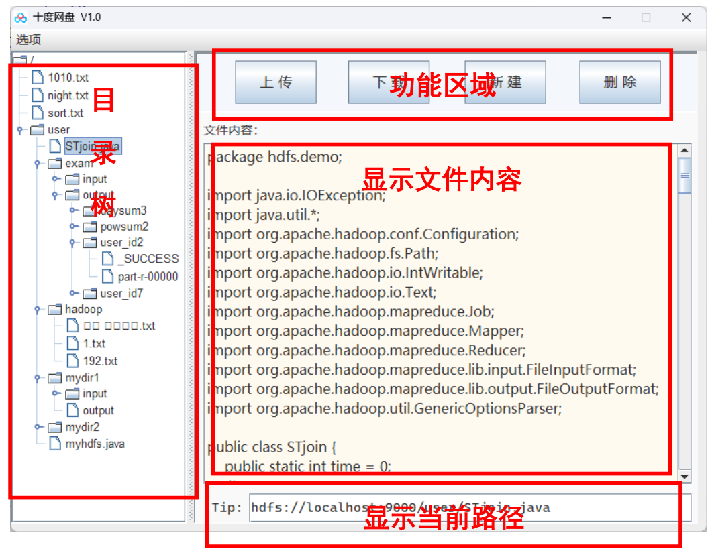

# HDFS-Net-Disk
完全基于Java开发的HDFS的网盘系统



# 功能概述

## 启动本地HDFS文件系统

```start-dfs.sh```

## 启动网盘

​		新用户首次进入系统，能够进行注册操作，对“账户名重复”，“密码与确认不一致”等
问题进行提示，并能将正确格式的数据添加到数据库中，保存用户信息为老用户。


未注册用户首次进入系统，可以进入注册页面进行注册，已注册的用户可以进行登录，
若用户不存或者密码错误则提示重新输入。用户名密码与数据库中的用户信息匹配，则进入
网盘主界面。


用户成功进入个人的网盘系统后，可以根据需要对自己的密码进行修改，对“密码与确
认不一致”等问题进行提示，并将修改后的的信息覆盖到数据库中，进行后续再次登录使用，
并注销此次登录。


一个优秀的 HDFS 网盘系统应该将以前对 HDFS 常用的命令行操作进行可视化的处理，
使用户能够更加高效的进行 HDFS 文件的分析。根据用户常用的 HDFS 管理需求，在此网盘
的图形化界面中设计了文件树、功能区域、文件浏览区域、菜单栏等。


## 文件上传

用户可以通过主界面，以可视化的形式，将客户端 Windows 或 MacOS 本地的文件上传
至 HDFS 网盘系统，并对文件目录错误、上传状态等信息进行提示，并刷新网盘使文件树可
视化，实现对 HDFS 中文件的层次结构及文件类型的可视化功能。

## 文件下载

用户可以通过主界面，以可视化的形式，将 HDFS 系统上的文件下载至客户端 Windows
或 MacOS 本地的文件系统，并对下载文件类型错误、下载状态等信息进行提示。

## 新建目录

用户可以通过主界面，通过选择可用目录后进行新建目录和对新目录命名的操作，对目
录选择错误进行提示，并刷新网盘使文件树可视化，实现对 HDFS 中文件的层次结构及文件
类型的可视化功能。

## 文件删除

用户可以通过主界面，通过选择文件后对文件进行删除或对文件夹进行删除的操作，对
目录选择错误进行提示，并刷新网盘使文件树可视化，实现对 HDFS 中文件的层次结构及文
件类型的可视化功能。

## 显示文件内容

用户可以通过主界面，通过选择文件后，在文件的显示区域，对可读文件进行内容的查
看，对目录选择后，则显示目录下的文件内容，实现对 HDFS 中文件的直接可读功能。

## 数据库说明

本机数据库用户名：root
密码：123456
数据库名：test1
表名：user
列：id(int)name(varchar)password(varchar)


